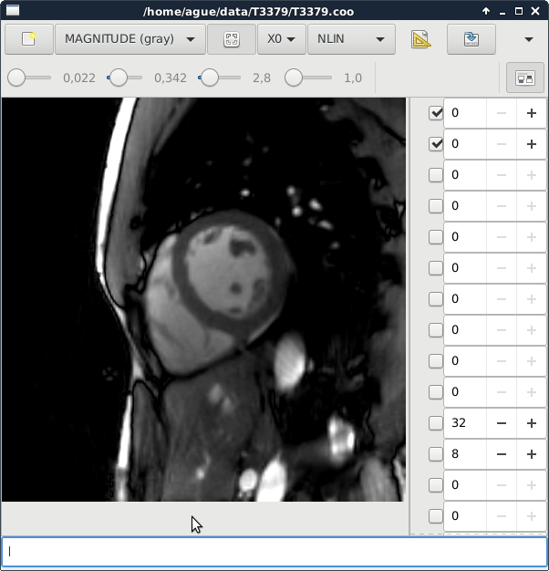

Small image viewer for multi-dimensional files. Compiles
on Linux and Mac OS X. It needs some libraries from
the Berkeley Advanced Reconstruction Toolbox (BART).

https://mrirecon.github.io/bart/

Installation:

Requires BART commit 9f9afd127db2690e91e36a12a552d4a4a64e0a43
or later.

Mac OS X:

sudo port install pkgconfig
sudo port install gtk3
sudo port install adwaita-icon-theme
sudo port install libomp

Linux:
sudo apt-get install libgtk-3-dev

Compile with make after setting the TOOLBOX_PATH
environment variable to the directory where BART
is installed.

### Usage

`view <images>...`

### Troubleshooting

If an error is raised along the lines of
`Gtk-WARNING **: cannot open display`, ensure X11 is installed
and running. On later versions of OS X, you may
need  for View to run.

Set the environment variable `DISPLAY=":0"`, run XQuartz,
and then retry `view`.

